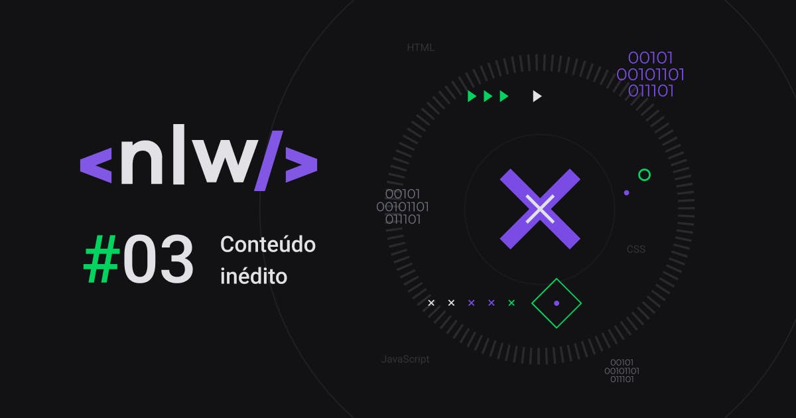

  

  

<h1 align = "center">
  Bringing happiness to the world.
</h1>

> Project Status: In development :warning:

## :page_facing_up: About
Happy is a Web and Mobile application that provides information about orphanages close to your home and with that you have the possibility to go to the place of distribution of happiness to children.

## :mortar_board: Project
Project developed during [Next week's Level] (https://nextlevelweek.com/inscricao/3) which is required by [Rocketseat] (https://github.com/Rocketseat) during October 12th, 18th 2020.

## :grey_exclamation: Prerequisites
- [Node.js](https://nodejs.org/en/)
- [NPM](https://www.npmjs.com/) or [Yarn](https://classic.yarnpkg.com/pt-BR/docs/install/#windows-stable)

## :construction_worker: How to use
### The front
- Clone this folder `git clone git@github.com:Freitas-gui/Next-level-week-3.git`
- Access to `cd lessons/web`
- Install as dependencies `yarn install` or` npm install` 
- Running `yarn start` or` npm start`

Project preview available at: http: // localhost: 3000

## :link: Layout
If you want to view the project layout, click on unwanted:

- [Layout Web](https://www.figma.com/file/mDEbnoojksG4w8sOxmudh3/Happy-Web/duplicate)
- [Layout Mobile](https://www.figma.com/file/X27FfVxAgy9f5IFa7ONlph/Happy-Mobile/duplicate)

## :rocket: Technologies Used
This project was developed using these technologies
- [Node.js](https://nodejs.org/en/docs/)
- [Typescript](https://www.typescriptlang.org/)
- [React](https://pt-br.reactjs.org/)

## :📚: Back-end, front-end and API concepts
ReactJS:
React is the most popular JavaScript library and is used to build a user interface (UI). It provides an excellent response for the user to add commands using a new method of rendering websites.

RESTful API:
RESTful API is an interface that provides data in a standardized format based on HTTP requests. Restful APIs increase performance for competitive situations, that is, when many people are asking for the same thing at the same time. They use verbs to define the purpose of the request being sent.

mermaid graph TD A [Front-end App - HTML, CSS, JS] - Requisition / orphanages -> B [Server Back-end - Database, email, authentication] B - List of orphanages in JSON - -> AC [Browser - Client]

Diagram of how the communication between the server, the front-end and the browser will be in the application

SPA (Single Page Applications):
The acronym SPA comes from Single Page Applications. In general, in a SPA application, the resources are loaded only once: the first time the user accesses the application. In this first access, all the HTML, CSS and JavaScript content is already transferred to the client. From this moment, when the user moves through the application pages, it will no longer be necessary to make requests to the server to load these new pages.

Typescript:
TypeScript is a superset of ECMAScript 6 which, in turn, is a superset of ECMAScript 5, which we use most often as a basis for our classic JavaScript. What is different about TypeScript from JavaScript are many things. Really many things. So much so that it would be impossible to go into detail about all of them here. What I'm going to bring in this article is just the most basic features and how to set up the environment so that your code works smoothly.

## :⚙️: Application development
First steps:

Install Node.js (version> 12.0)
Install a package manager for Node.js modules (ex: yarnpkg, npm ...)
Using npx, run the command:
npx create-react-app web --template typescript

Using yarn, run the command:
yarn create react-app web --template typescript